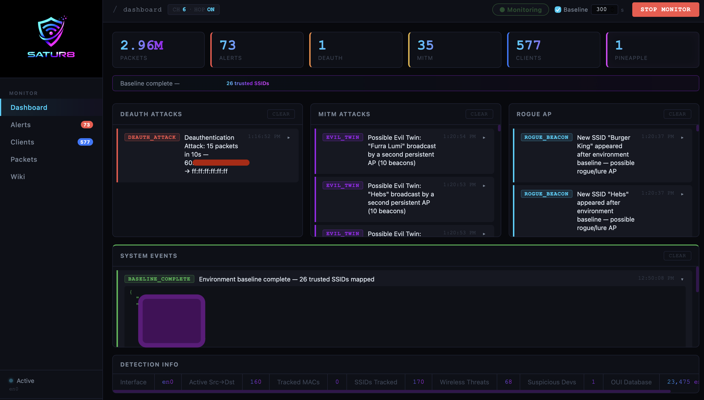
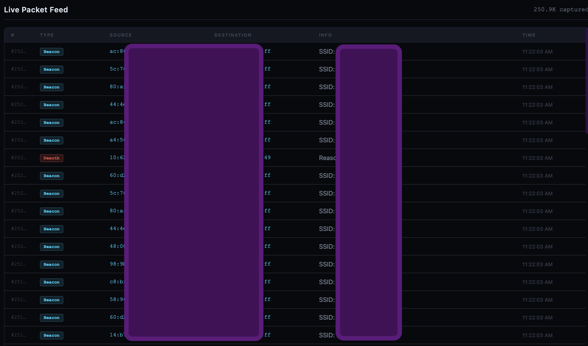

# Satur8 - Nightmare through the air

<p align="center">
  
</p>

Satur8 is a passive WiFi security monitoring framework written in Python. It captures raw 802.11 frames and ARP traffic from a wireless interface operating in monitor mode, runs a set of detection engines against the captured data, and exposes findings through a real-time web dashboard over WebSocket. No traffic is injected and no active probing is performed.

---

## Screenshots

<p align="center">
  
  <br/>
  <em>Dashboard</em>
</p>

<p align="center">
  
  <br/>
  <em>Live Packet Feed</em>
</p>

---

## Architecture

The codebase is divided into two top-level packages.

`core/` contains the packet capture engine and all detection modules. Each detector is a self-contained class that receives individual packets from the sniffer and maintains its own state. Alerts are not written to disk by the detectors themselves but are instead passed to a shared `AlertManager` instance, which fans them out to registered callbacks.

`web/` contains a Flask application with Flask-SocketIO. The web layer registers itself as a callback on the `AlertManager` so that every new alert is immediately pushed to all connected browser clients over a persistent WebSocket connection. The REST API exposes statistics and alert history for polling clients.

```
Scapy sniffer thread
        |
        v
  PacketSniffer.packet_handler()
        |
        +---> DeauthDetector.analyze_packet()
        |
        +---> MITMDetector.analyze_packet()
        |
        +---> DeviceFingerprinter.analyze_packet()
                      |
                      v
               AlertManager.emit_alert()
                      |
                      v
          WebSocket push to all browser clients
```

---

## Detection Engines

### Deauthentication Attack Detection

The `DeauthDetector` inspects every captured `Dot11Deauth` frame. It tracks a sliding time window of deauth packets grouped by source MAC address and destination MAC address pair. When the count of deauth frames originating from a single source exceeds the configured threshold within the configured time window, a `DEAUTH_ATTACK` alert of severity `high` is emitted.

A per-pair cooldown timer prevents the same attack burst from re-triggering the alert on every subsequent packet. After the cooldown expires, the pair re-enters tracking state and can alert again if the attack resumes. Broadcast source addresses are discarded because they cannot be meaningfully attributed to an attacker.

Configurable parameters:

* `DEAUTH_THRESHOLD` — number of deauth frames required to trigger (default 15)
* `DEAUTH_WINDOW` — rolling time window in seconds (default 10)

### ARP Spoofing and MITM Detection

The `MITMDetector` tracks the mapping between MAC addresses and IP addresses as observed in ARP traffic. When it sees an ARP reply that maps an IP address to a MAC address that is different from the MAC address that was previously associated with that IP, it emits an `ARP_SPOOFING` alert. This is the canonical indicator of an ARP poisoning attack where an adversary is redirecting traffic through a device they control.

A separate sub-detector counts the rate of ARP requests originating from a single MAC address. An abnormally high ARP request rate is a behavioral indicator of a host actively attempting to poison the ARP caches of many targets simultaneously. When the request count from a single MAC exceeds the threshold within the time window, an `ARP_FLOOD` alert is emitted.

Both sub-detectors use per-source cooldown timers to suppress duplicate alerts from the same offender during an ongoing attack session.

Configurable parameters:

* `ARP_THRESHOLD` — ARP request rate threshold (default 200 per window)
* `ARP_WINDOW` — rolling time window in seconds (default 10)

### Evil Twin Access Point Detection

The `MITMDetector` also tracks 802.11 Beacon and Probe Response frames. For each SSID observed on the network, it builds a mapping of the BSSIDs (access point MAC addresses) that are transmitting that SSID. A BSSID is not considered confirmed until it has been seen transmitting at least 20 beacons, which filters out brief signal bleed from physically adjacent networks and RF noise artifacts that produce malformed beacon reads.

Once the first legitimate BSSID for an SSID is confirmed, any new BSSID that subsequently begins broadcasting the same SSID and accumulates enough beacons to cross the rogue threshold is flagged as a potential evil twin. The alert includes both the legitimate BSSID and the rogue BSSID so the operator can compare them directly.

Configurable parameters:

* `BEACON_THRESHOLD` — distinct SSIDs from the same BSSID before suspicion (default 3)
* `BEACON_WINDOW` — tracking window for beacon counts in seconds (default 30)

### Karma Attack Detection

The Karma attack causes a rogue access point to respond to 802.11 Probe Request frames with a spoofed Probe Response claiming to be any SSID the probing device requests. The `MITMDetector` detects this by tracking Probe Response frames. If a BSSID sends Probe Responses for multiple different SSIDs without having previously transmitted Beacon frames for those SSIDs, it is flagged.

A minimum Probe Response count gate prevents false positives from legitimate access points whose Probe Responses arrive at the capture interface before their Beacon frames due to timing or channel position.

Configurable parameters:

* `KARMA_PROBE_THRESHOLD` — distinct probe SSIDs responded to by the same BSSID before alerting (default 4)

### WiFi Pineapple Detection

The `DeviceFingerprinter` detects WiFi Pineapples and similar rogue hardware over the air using the following signals.

**OUI matching.** The first three octets of every MAC address observed on the wireless network are looked up against the IEEE OUI database (`oui.txt`). A static list of OUIs assigned to Hak5 and related manufacturers is maintained in `Config.SUSPICIOUS_OUIS`. Any device broadcasting with a matching MAC prefix generates a `SUSPICIOUS_DEVICE` alert. This works specifically for devices like the WiFi Pineapple because Hak5 holds distinctive IEEE-assigned OUIs that do not appear in legitimate consumer hardware.

**Behavioral detection.** Alfa adapters and other common pentest hardware cannot be identified over the air by MAC prefix because they use chipsets from Realtek, Ralink, and Mediatek whose OUIs appear across millions of legitimate consumer devices. What Satur8 detects is the behavior of an attacker using those adapters: deauthentication floods, ARP spoofing, evil twin access points, and Karma attacks — all of which produce distinctive patterns that the other detection engines catch regardless of what hardware the attacker is using.

**Multi-SSID and Karma beacon analysis.** A device broadcasting confirmed beacons for more than `BEACON_THRESHOLD` distinct SSIDs, or responding to probe requests for SSIDs it has never beaconed, is flagged as a Pineapple or Karma device. These behaviors are characteristic of Pineapple attack modes and are observable from any attacker, regardless of adapter brand.

A per-OUI suppression set prevents duplicate alerts from the same vendor across multiple packets.

### Baseline Environment Scanning

Before running continuous detection, the operator can initiate a baseline scan of configurable duration (default 5 minutes). During the baseline phase, the `MITMDetector` collects all observed SSIDs and their associated BSSIDs without generating evil twin or Karma alerts. On completion, the confirmed SSID-to-BSSID mappings are serialized to `baseline.json` and persisted to disk.

On subsequent runs, the persisted baseline is loaded at startup. SSIDs that were present in the baseline are subject to standard detection thresholds. SSIDs that were not in the baseline are treated with tighter thresholds (`POST_BASELINE_CONFIRM = 2` beacons to confirm, `POST_BASELINE_ROGUE = 10` beacons to alert), because a completely new SSID appearing after a known-good environment scan has been established is a stronger indicator of an attack.

### OUI Database

The IEEE OUI database is loaded from `oui.txt` at startup and held in memory as a plain dictionary providing O(1) vendor lookups by the 24-bit OUI prefix. The parser handles both the condensed plain format shipped with this project and the standard IEEE download format from `standards-oui.ieee.org`. If the file is absent, lookups degrade gracefully and return `None` rather than raising an exception.

---

## Web Dashboard

The dashboard is served by Flask on `0.0.0.0:1472` by default and is accessible at `http://localhost:1472` from the host machine. A persistent WebSocket connection (managed by Flask-SocketIO on the server side and Socket.IO on the client side) delivers alerts and statistics updates in real time without polling.

The interface provides:

* Live alert feed with severity classification (`low`, `medium`, `high`, `critical`) and structured metadata for each event
* Per-type and per-severity alert counters
* Packet capture statistics including total packet count and per-type breakdown
* List of all discovered devices with resolved vendor names from the OUI database
* OUI database status showing entry count and source path
* Controls to start and stop the packet capture engine without restarting the process
* Baseline scan initiation with configurable duration

All alert state is kept in a bounded in-memory deque (`maxlen=1000`). The REST endpoint `GET /api/alerts` returns the full current alert history as JSON. The endpoint `GET /api/stats` returns aggregate statistics. The endpoint `GET /api/devices` returns the discovered device table.

---

## Channel Hopping

When `CHANNEL_HOP` is enabled, the sniffer cycles through all 2.4 GHz channels (1 through 13) at the interval specified by `CHANNEL_HOP_INTERVAL`. This allows detection of activity across the full band without locking to a single channel at the cost of missing some frames on each channel during the hop interval. On macOS 14 and later, channel control via the `airport` utility is unavailable because Apple removed it, so channel hopping is silently skipped on that platform.

---

## Platform Compatibility

| Platform | Status | Notes |
|---|---|---|
| macOS | Compatible | Tested and working. Channel hopping unavailable on macOS 14+ (airport removed by Apple) |
| Linux | Not tested | Should work. Full channel hopping support via iwconfig |
| Windows | Coming Soon | Not currently supported |
---

## Requirements

* Python 3.8 or later
* Root or Administrator privileges (required by libpcap for raw packet capture)
* A wireless adapter that supports monitor mode


Python dependencies are listed in `requirements.txt`:

```
scapy >= 2.5.0
flask >= 3.0.0
flask-socketio >= 5.3.0
flask-cors >= 4.0.0
python-socketio >= 5.10.0
netifaces >= 0.11.0
psutil >= 5.9.0
python-dotenv >= 1.0.0
```

---

## Installation

```bash
git clone https://github.com/youruser/satur8.git
cd satur8
./setup.sh
```

The setup script creates a Python virtual environment, installs all dependencies into it, and copies `.env.example` to `.env`. Open `.env` and set `INTERFACE` to the name of your monitor-mode wireless interface before starting.

Manual installation:

```bash
python3 -m venv venv
source venv/bin/activate
pip install -r requirements.txt
cp .env.example .env
```

---

## Configuration

All runtime parameters are read from environment variables. Defaults are defined in `config.py` and can be overridden via the `.env` file or the process environment.

| Variable | Default | Description |
|---|---|---|
| `INTERFACE` | `wlan0` | Wireless interface to capture on |
| `HOST` | `0.0.0.0` | Web server bind address |
| `PORT` | `1472` | Web server port |
| `CHANNEL` | `6` | Default monitoring channel |
| `CHANNEL_HOP` | `true` | Enable channel hopping across 2.4 GHz band |
| `CHANNEL_HOP_INTERVAL` | `0.5` | Seconds spent on each channel during hopping |
| `DEAUTH_THRESHOLD` | `15` | Deauth frames per window to trigger alert |
| `DEAUTH_WINDOW` | `10` | Deauth detection time window in seconds |
| `ARP_THRESHOLD` | `200` | ARP requests per window to trigger flood alert |
| `ARP_WINDOW` | `10` | ARP detection time window in seconds |
| `BASELINE_DURATION` | `300` | Duration of baseline environment scan in seconds |
| `BASELINE_FILE` | `baseline.json` | Path to persist the baseline SSID map |
| `DEBUG` | `false` | Enable Flask debug mode |

---

## Usage

```bash
sudo ./start.sh
```

Or directly:

```bash
sudo python3 main.py
```

Root privileges are required because raw packet capture via libpcap requires access to network device file descriptors that are restricted to the superuser.

**macOS note:** Before starting, disconnect from any WiFi network (do not turn WiFi off, just disconnect from the network). The wireless adapter must be free and not associated to an AP for monitor mode to activate. Turning WiFi off entirely prevents libpcap from opening the interface.

Once the process starts, open `http://localhost:1472` in a browser. The packet capture engine does not start automatically. Use the Start button in the dashboard to begin capturing. This allows configuration review before any packets are captured.

To establish a baseline of the environment before enabling full detection, click the Baseline Scan button. After the scan completes, the SSID map is saved to `baseline.json` and subsequent detection runs use it to distinguish known-good networks from newly appeared ones.

---

## Project Phases

| Phase | Status | Description |
|---|---|---|
| Phase 1 — Passive Monitoring | **Current** | Single-adapter passive capture. All detection is read-only: the adapter operates in monitor mode and never transmits. Covers deauthentication floods, ARP spoofing, evil twin APs, Karma attacks, WiFi Pineapple identification, and baseline environment scanning. |
| Phase 2 — Active Intelligence Gathering | **Coming Soon** | Dual-adapter operation. The first adapter continues passive monitoring while the second adapter actively interacts with identified attacker MITM devices to probe and extract additional intelligence — including hardware fingerprints, firmware signatures, and attacker-controlled network topology — without disrupting the monitored environment. |
| Phase 3 — Offensive Countermeasures | **Closed Source** | Multi-adapter operation (3+). Extends Phase 2 with full offensive capability: sustained passive monitoring, active data collection against the attacker's device, and targeted countermeasures that turn the attacker's tools against them. This phase will not be publicly released. |

---

## Legal Notice

This software captures wireless frames from the radio frequency spectrum. Use it only on networks you own or have received explicit written authorization to test. Unauthorized interception of network communications is a criminal offense under the Computer Fraud and Abuse Act, the Electronic Communications Privacy Act, and equivalent legislation in other countries.
